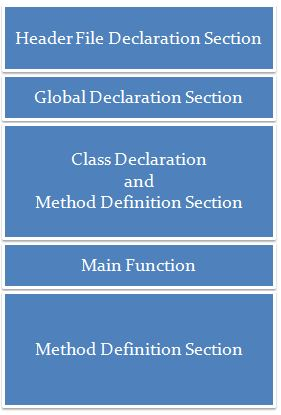

#2. Programming Principles.


##Basic Structure


#### Hello World

```cpp
#include <iostream>

int main(int argc, char* argv[])
{
    std::cout << "Hello World!" << std::endl;
    return 0;
}
```


#### Structure of a C/C++ source code (main)




#### Hello World second version

```cpp
#include <iostream>

using namespace std;

int main(int argc, char* argv[])
{
    cout << "Hello World!" << endl;
    return 0;
}
```


#### Variables

+ A variable is a container for a value.
+ It requires a type and an identifier.


#### Identifiers

+ Can start with a _ or a character
+ It can be followed by _ , characters or numbers
+ Names are case sensitives


#### Types

+ Primitives
  + Char
  + Integer
  + Float
  + Double


#### Non - primitives

+ String
+ Iterators


#### Example declaring a variable

```cpp
#include <iostream>

using namespace std;

int main(int argc, char argv)
{
    char a_small_number;
    int _this_is_a_big_number;
    float decimal1;
    double more_numbers_after_dot;
}
```
